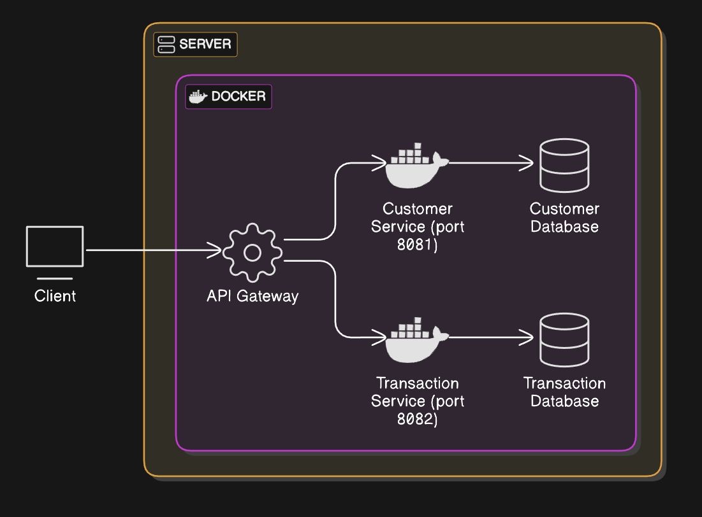
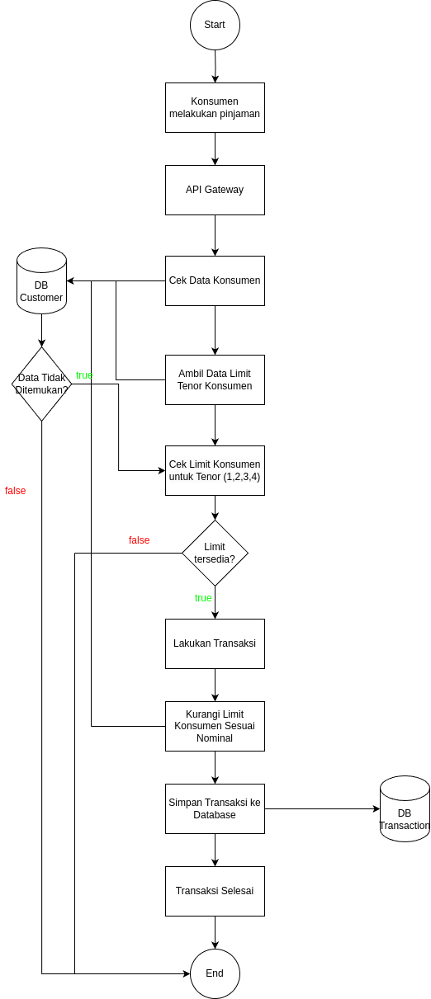
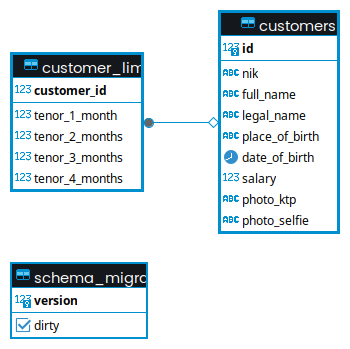
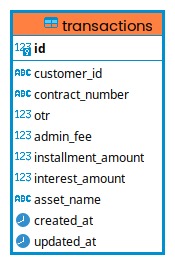

# Tes Kredit Plus Loan Tenor System
This project is a loan tenure system designed with a microservice architecture to ensure scalability. It uses gRPC for communication between services and additionally, the system has implemented Clean Architecture and has been Dockerized for easy deployment.

# Overview
The Loan Tenure System includes several microservices, each responsible for different aspects of the application, such as customer management, loan limit management, and transaction processing. By leveraging microservices and gRPC, the system ensures efficient communication, scalability, and maintainability.

# Architecture Diagram

# Flowchart Diagram

# Structure Database
#### Customer

#### Transaction

# Run App
you just have to run the command below
`docker-compose up -d`
and wait for all services to run successfully
